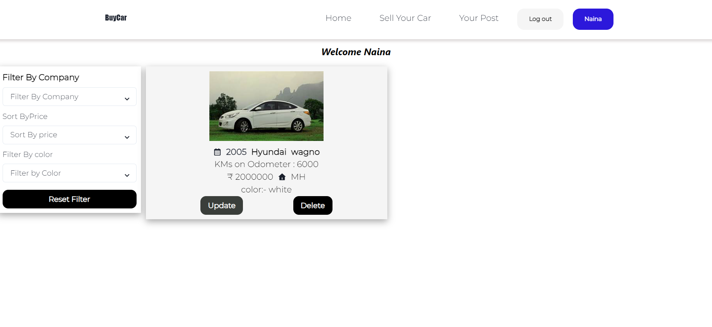

# BuyCar_Corp MERN Stack application

## Description
BuyCar is a website for users as well as dealers. Dealers can list their cars online for users who want to buy second-hand cars. This project is an individual assignment where I have utilized the MERN stack to create a web application that provides integration between the frontend and backend components.


## Tech Stack
**Frontend**: React.js, Redux, Chakra UI, JavaScript, REST API, CSS3, HTML5  
**Backend**: Node.js, Express.js, MongoDB  
**Deployed On**: Vercel
"[https://frontend-nainapremani.vercel.app/](https://buycar-corp.onrender.com)"

## Features

1. User Authentication:
   
   
   - Users can create an account and log in securely to the application.
   - Passwords are hashed and stored securely to ensure data protection.

3. Home Page:
   
   - Upon logging in, users can view the car's list of available options.
   - It has a filter option on the left side to filter the list accordingly.

5. Sell Your Car Page:
   
   - Here the user can add the car
      
7. Post Page:
   
   - Users can add posts here.
   
   - Here User has two options to update details or to delete the post
     

## Installation

To run the BuyCar Corp locally, follow these steps:

1. Clone the repository:

   ```
   git clone https://github.com/your-username/BUYC_Corp.git
   ```

2. Navigate to the project directory:

   ```
   cd BUYC_Corp
   ```

3. Install the required dependencies:

   ```
   npm install
   ```

4. Set up the environment variables:
   - Rename the `.env.example` file to `.env`.
   - Replace the placeholder values in the `.env` file with your own configuration, such as the database connection details and API keys.

5. Start the application:

   ```
   npm start
   ```


  
